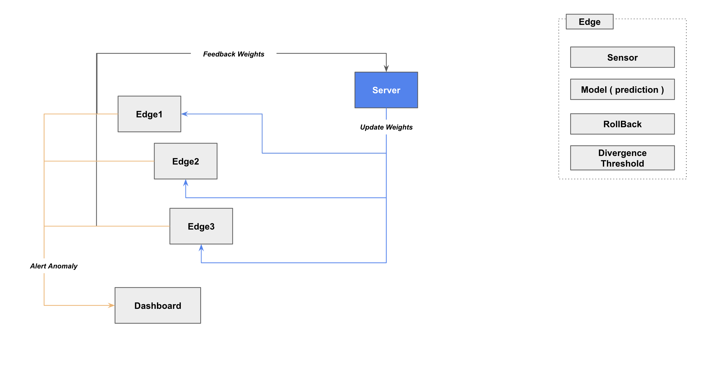
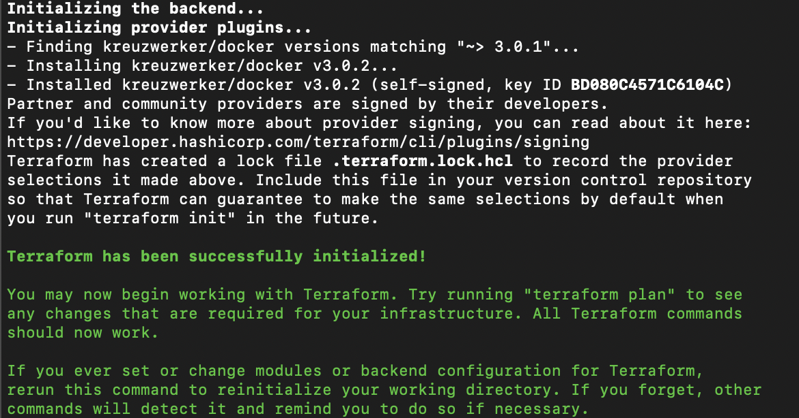
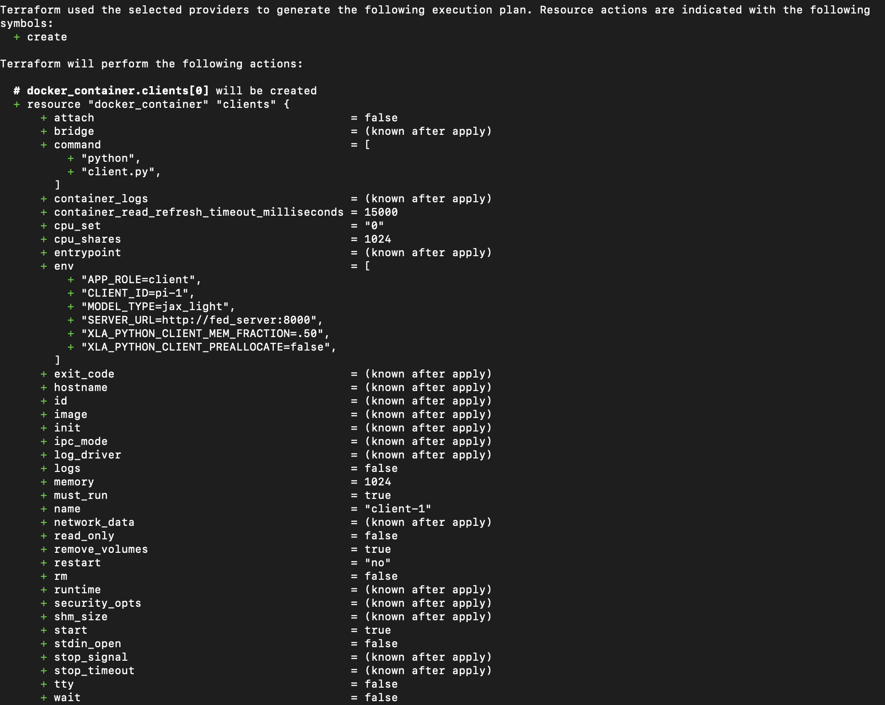
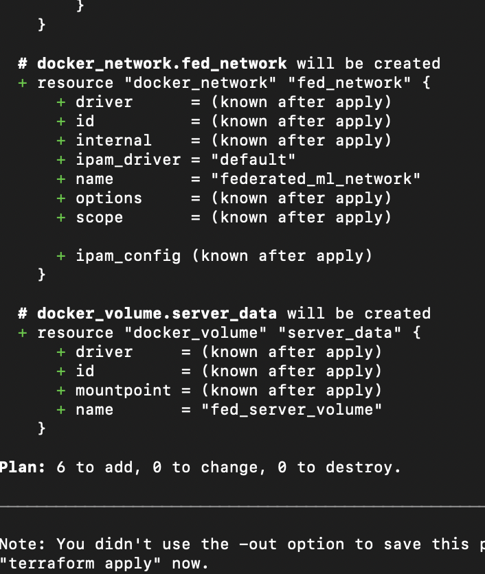
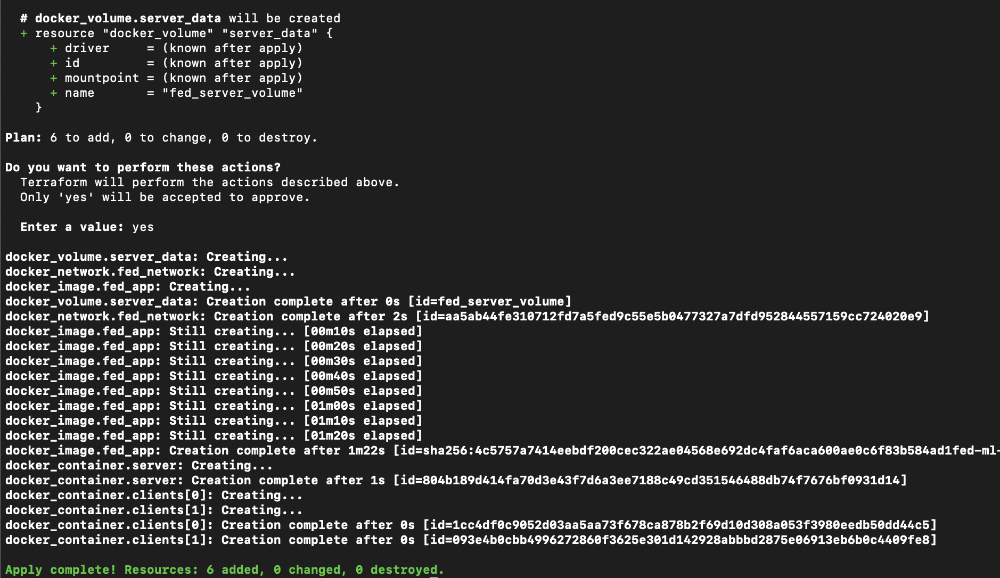
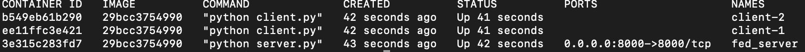
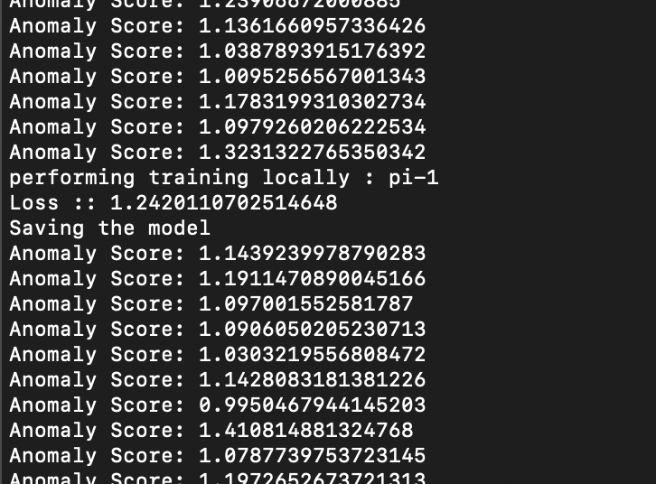
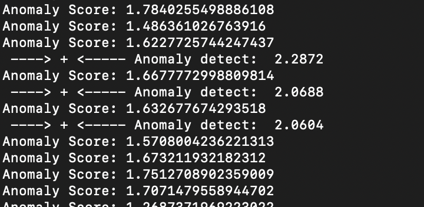
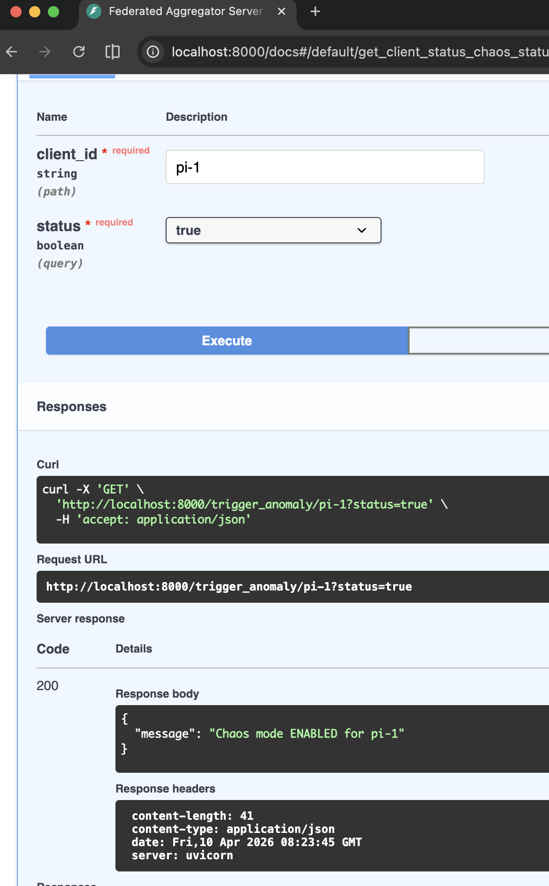
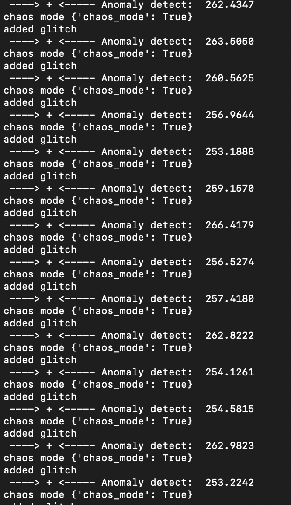

# federated-ml
Examples, demos and projects implementing federated machine learning

-----
Arch
-----

-----
How to run in cli
-----
<code>
terraform init  

terraform plan  

terraform apply 

</code>

If any updates are made to `main.tf`

then rerun all steps
<code>
terraform init -upgrade  
terraform plan  
terraform apply  
</code>

Any updates to the code files

then only run 
`terraform apply -replace="docker_image.fed_app`
this replaces the build 

finally, `docker ps` should result  

Now, to stop everything  
`terraform destory`

-----
To check the logs
-----
This would open an output stream of logs in the terminal
<code>
docker logs -f client-1 
</code>

<em>Can this be considered as systemic errors ? </em> 

-----
To trigger an attack
-----

<em> After attack </em> 

